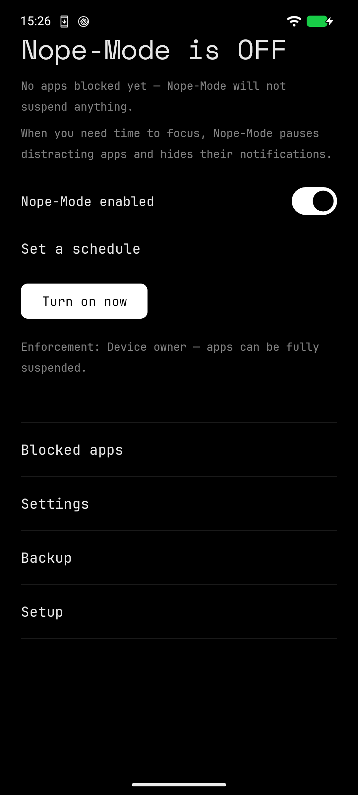

# Nope-Mode

> Selected apps go silent and un-openable — on a schedule, or because you said so.

A cleanroom equivalent of Focus Mode, for GrapheneOS, where Digital Wellbeing
does not exist. No accounts, no network, no analytics — the manifest declares no
`INTERNET` permission, so there is nothing to leak and nothing to audit.




**Status:** provisioned and enforcing on a Pixel 6 running GrapheneOS. Device
owner is granted, the notification listener and the accessibility service are
enabled, and the app holds Do Not Disturb policy access — the "Quiet Ringer needs
Do Not Disturb access" warning no longer appears. The home screen reports
*Enforcement: Device owner — apps can be fully suspended.*

224 unit tests across 23 classes, all green (`./gradlew testDebugUnitTest`).

Still open: the backup screen renders a title and a hint and nothing else.
`BackupActivity.exportJson` and `restoreJson` have no caller outside the test
suite, there is no file picker, and `restoreJson` stops after the validator
without committing anything to the Room DAOs. The JSON round-trip and the
validation gate are covered by tests; the screen is not a feature yet.

See [design.md](design.md) for the spec and [todo.md](todo.md) for history —
todo.md lags the code, and several items it lists as open are done.

## What it does ⚙️

- Pick the apps allowed to bother you, and the ones that aren't.
- When Nope-Mode is on, blocked apps produce **no notifications, no sound, no
  vibration**, and **cannot be opened**.
- Turn it on by hand, from a Quick Settings tile, or let the schedule do it.
- **Default schedule: 20:00 → 08:00, daily.**

## How it works

Nope-Mode runs as a **device owner** and calls the platform's
`setPackagesSuspended` — the mechanism behind Focus Mode itself. A suspended app
cannot show notifications, play audio, raise dialogs, or launch. It survives
reboots, which a Shizuku-based approach does not.

Where device owner isn't provisioned, Nope-Mode falls back to a notification
listener plus an accessibility service. That tier runs anywhere and is leakier —
a notification may make a sound before it is suppressed.

## Setup 🛠️

Device owner can be provisioned **only** while the device has zero accounts and
zero secondary profiles. That constraint is the whole reason Nope-Mode is the
first app installed on a fresh device. This one was:

```sh
adb shell dpm set-device-owner com.piercingxx.nopemode/.admin.NopeDeviceAdminReceiver
```

Add a Google account first and the window closes. Reopening it costs a factory
reset.

Device owner is a full MDM role and carries real tradeoffs — some banking and DRM
apps refuse to run on a managed device. Nope-Mode always exposes a **Relinquish
device owner** action, so backing out costs nothing. Read §2.2 of
[design.md](design.md) before provisioning.

## Theme sync 🌀

All nine family apps share one contract. XX-Launcher broadcasts
`xx.launcher.THEME_CHANGED` with a theme name and a background ARGB; every app
runs an exported receiver, persists the choice, and repaints. Eight presets:
AMOLED Night, Graphite, Forest Night, Ocean Drift, Burgundy, Paper, Mist, Custom.
Change the theme in the launcher and Nope-Mode follows without being opened.

## Requirements 🧪

- Android 7.0+ (minSdk 24), targetSdk 35
- Verified on a Pixel 6 running GrapheneOS
- Device owner for full enforcement; otherwise the fallback tier

## License

Copyright (c) 2026 PiercingXX. All rights reserved.

No code is derived from Hail, NotiFilter, DetoxDroid, or any other GPL project.
Nope-Mode is a cleanroom implementation written against public Android API
documentation.
